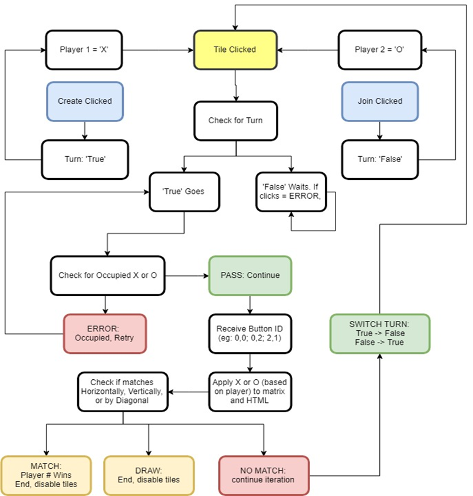

# Background Information
A simple game of tic-tac-toe. I completed this project 
long ago when I didn't have much experience. The server is 
running on the backend, so there is no way for the user to cheat. 
One session of two players is supported only; however, it is
easy to improve the project to provide multiple sessions based on 
room id.

# Languages & Libraries used

HTML, CSS, jQuery, JavaScript, Socket.IO, ExpressJS

# Description

1. Launch the website from two different windows (supports 1 session at the time only)
2. Assigns 2 variables called Player1 as X and Player2 as O
3. Player class is created, which contains:
   
   - current turn (boolean)
   - player type (X or )

4. Clicking the create button does the following:

   - Player1 becomes X
   - Turn becomes True

5. Clicking the next button does the following:

   - Players2 becomes O
   - Turn becomes False

6. Clicking on the tile does the following:

   - Check whether it is player's turn and toggles the SockedID
   - Making another turn would throw an error
   - Clicking occupied error would throw an error
   - Checks the matrix horizontally, vertically, and diagonally whether user has won.
     
     - Example:
     
       - Clicking the tile (1,2), system would check horizontally for the row 1. 
       Rows 0 and 2 are skipped for performance optimization purposes.
       Hence, the same logic is used for vertical and horizontal checks. 
       Each click toggles players' turn to false or true.

7. Clicking the reset button by any player resets the game.
8. Closing the browser window, refreshes the game for any other active player.

# Server Side Features

- Server keeps track of every action using Socket.IO in real-time
- Game matrix is (3x3)
- Accepts and updates moves and as well as switches player turns (updates the board)
- Prompts alert when player is trying to cheat (not their turn)
- Keeps track of the reset button (disables or enables it)
- Resets the game when player closes the window

# Client Side Features

- Receives and accepts messages from the server via Socket.IO
- Sends player's move to the server
- Sends the game actions to the server

# Installation

1. Run ```npm install```
2. Install NodeJS
3. Run ```node index.js```
4. Access the game from different windows via ```localhost:3000``` URL

    - One player can start/reset the game only (before it is started)
    - System will notify next player's move
    - Any player can reset during the game
    - Once the game is created, button is disabled and JOIN is enabled.

# UML Diagram


